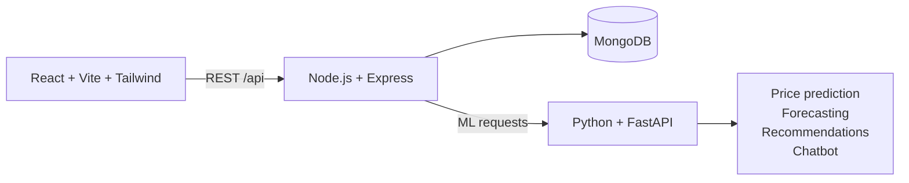

# BricksBrain AI

<p align="center">
  
</p>

<h3 align="center">Smarter real estate decisions, powered by AI.</h3>

<p align="center">
  Discover properties, understand local markets, forecast prices, and explore homes in 3D from one full-stack platform.
</p>

<p align="center">
  <a href="https://github.com/Sachin993533/Bricksbrain-AI"></a>
  
  
  
  
</p>

<p align="center">
  <a href="#quick-start">Quick start</a> ·
  <a href="#feature-highlights">Features</a> ·
  <a href="#architecture">Architecture</a> ·
  <a href="#api-overview">API</a>
</p>

> A complete, runnable real-estate demo combining a React + Tailwind experience, an Express API, MongoDB persistence, and a Python ML service. The included models use realistic synthetic data so the project works without proprietary MLS data.

## Feature highlights

### Intelligence for every decision

- **AI price prediction** using a scikit-learn `RandomForestRegressor` trained on a 6,000-row Indian real-estate dataset.
- **Future price forecasting** with ARIMA plus a neural forecaster, using an automatic lightweight MLP fallback when TensorFlow is unavailable.
- **Personalized recommendations** based on property features, user preferences, viewed history, and saved listings.
- **Area Intelligence** with locality scores, connectivity, safety, nearby schools and hospitals, and five-year growth.

### Tools buyers actually use

- Search and filter listings by city, type, listing mode, BHK, price, and sort order.
- Compare up to four properties side by side.
- Calculate EMI with a year-by-year amortization schedule.
- Explore a procedural Three.js **3D Digital Twin** for each property.
- Generate a branded, downloadable PDF report directly in the browser.
- View Google Maps when configured, with a graceful fallback when no API key is present.

### A complete platform workflow

- Floating rule-based AI chatbot for property, EMI, pricing, and area questions.
- Authenticated users can list properties with up to eight photos.
- Admin approval workflow keeps user-submitted listings pending until reviewed.
- AI interior design suggestions with optional OpenAI image generation and a no-key inspiration fallback.
- JWT authentication, bcrypt password hashing, role-based access, user dashboard, and admin analytics.

---

## Architecture



The frontend is the user-facing application, the Express backend owns authentication and property workflows, MongoDB stores users and listings, and the FastAPI service handles the machine-learning features.

## Project structure

```
bricksbrain-ai/
├── backend/            Node.js + Express REST API
│   ├── config/db.js
│   ├── models/          User.js, Property.js  (Mongoose)
│   ├── controllers/      auth, property, chat, admin
│   ├── routes/
│   ├── middleware/       auth (JWT), upload (multer photo uploads), error handler
│   ├── uploads/           uploaded property photos (served at /uploads)
│   ├── seed.js           seeds 120 demo properties + demo/admin users
│   └── server.js
├── ai-service/          Python + FastAPI ML microservice
│   ├── main.py            API endpoints
│   ├── train.py           generates dataset + trains price model
│   ├── models/
│   │   ├── price_predictor.py   RandomForest price prediction
│   │   ├── forecast.py          ARIMA + LSTM/MLP forecasting
│   │   ├── recommender.py       content-based recommendation engine
│   │   ├── chatbot.py           intent-based chat NLU
│   │   └── interior_design.py   AI interior design ideas (with curated fallback)
│   └── data/               generated CSVs (dataset + price history)
└── frontend/            React + Vite + Tailwind CSS
    └── src/
        ├── pages/          Home, Listings, PropertyDetail, ListProperty, Dashboard, AdminDashboard, ...
        ├── components/     Navbar, PropertyCard, Chatbot, DigitalTwin3D, MapView, EMICalculator, CompareTable, InteriorDesign
        ├── utils/           generateReport.js (client-side PDF report generation)
        ├── context/        AuthContext
        └── api/axios.js
```

---

## Quick start

### Prerequisites

- Node.js 18 or newer
- Python 3.10 or newer
- A MongoDB instance, local or Atlas

### Clone and enter the project

```bash
git clone https://github.com/Sachin993533/Bricksbrain-AI.git
cd Bricksbrain-AI
```

### 1. MongoDB
Run MongoDB locally (`mongod`) or use a free [MongoDB Atlas](https://www.mongodb.com/atlas) cluster.
Either way, you just need a connection string for `MONGO_URI` in the backend `.env` (see below).

### 2. AI/ML service (Python)
```bash
cd ai-service
pip install -r requirements.txt
python train.py          # generates dataset + trains the price model (~30s, pre-trained artifacts already included)
cp .env.example .env      # optional — only needed for real AI-generated interior design images
uvicorn main:app --reload --port 8000
```
Optional — for a real LSTM instead of the automatic MLP fallback:
```bash
pip install tensorflow-cpu
```

### 3. Backend (Node.js)
```bash
cd backend
cp .env.example .env     # edit MONGO_URI / JWT_SECRET if needed
npm install
npm run seed              # populates 120 demo properties + demo/admin accounts
npm run dev                # http://localhost:5000
```

### 4. Frontend (React)
```bash
cd frontend
cp .env.example .env      # optionally add a Google Maps API key
npm install
npm run dev                 # http://localhost:5173
```

Open **http://localhost:5173** — the app is fully functional end-to-end.

### Demo logins (created by `npm run seed`)
| Role | Email | Password |
|---|---|---|
| Admin | admin@bricksbrain.ai | admin123 |
| User | demo@bricksbrain.ai | demo1234 |

---

## Environment variables

**backend/.env**
```
PORT=5000
NODE_ENV=development
MONGO_URI=mongodb://localhost:27017/bricksbrain
JWT_SECRET=change_this_to_a_long_random_secret
JWT_EXPIRES_IN=7d
AI_SERVICE_URL=http://localhost:8000
CLIENT_URL=http://localhost:5173
GOOGLE_MAPS_API_KEY=your_google_maps_api_key_here
```

**ai-service/.env** (optional)
```
# Only needed for real AI-generated interior design images.
# Without it, the Interior Design feature still works -- it shows a curated
# inspiration gallery + written design tips instead.
OPENAI_API_KEY=
```

**frontend/.env**
```
VITE_API_BASE_URL=http://localhost:5000/api
VITE_GOOGLE_MAPS_API_KEY=            # optional — leave blank to use the built-in fallback map link
```

---

## API overview

```
POST   /api/auth/register
POST   /api/auth/login
GET    /api/auth/me

GET    /api/properties                 (filters: city, propertyType, listingType, bhk, minPrice, maxPrice, sort, page)
GET    /api/properties/featured
GET    /api/properties/:id
POST   /api/properties/:id/save        (toggle wishlist)
POST   /api/properties/compare          { ids: [...] }
GET    /api/properties/recommendations (auth required)
POST   /api/properties/predict-price   -> proxies to AI service
POST   /api/properties/forecast        -> proxies to AI service (ARIMA + LSTM)
POST   /api/properties/emi
POST   /api/properties/interior-design -> proxies to AI service (auth required)
POST   /api/properties/list             (auth required, multipart/form-data with up to 8 "images") -- Post Your Property
GET    /api/properties/my-listings     (auth required) -- your own submitted listings
PUT    /api/properties/:id             (auth required — owner or admin)
DELETE /api/properties/:id             (auth required — owner or admin)

POST   /api/chat                        -> proxies to AI chatbot

GET    /api/admin/stats                (admin only)
GET    /api/admin/pending-properties   (admin only) -- listings awaiting review
```

AI microservice (FastAPI, auto docs at `http://localhost:8000/docs`):
```
POST /predict-price
POST /forecast-price
POST /recommend
POST /chatbot
POST /interior-design
```

---

## How "Post Your Property" works

Any logged-in user can go to **Post Property FREE** in the navbar (or `/list-property`) to submit
a listing with photos. Submissions from regular users are saved with `status: "Pending"` and won't
appear in public listings until an admin approves them from the **Pending Approvals** panel on the
Admin Dashboard. Listings created directly by an admin go live immediately. Users can track the
status of everything they've posted under **Dashboard → My Listings**.

## How the AI interior design feature works

On any property page, open **AI Interior Design Ideas**, pick a room and a style, and generate
suggestions. If `OPENAI_API_KEY` is set in `ai-service/.env`, real AI-generated room images are
requested from OpenAI's image API. If no key is set, you still get a curated inspiration gallery
and a written set of design tips for that style — no key required to try the feature.

## How the downloadable report works

On any property page, click **Report** next to the save button to generate and download a
branded PDF summarizing the property's details, description, amenities, area intelligence, and
(if you've already run them on that page) the AI price prediction and forecast. This is generated
entirely client-side with `jspdf` — no backend call needed.

---

## Notes & next steps for production

- The ML price model is trained on **synthetic** data for demo purposes — retrain
  `ai-service/train.py` against real listing data for production accuracy.
- The chatbot uses rule-based intent classification (fast, free, no API key). To upgrade
  it to a generative LLM, swap the internals of `generate_reply()` in `chatbot.py` to call
  an LLM API using the extracted intent/slots as context.
- The 3D Digital Twin is a procedurally generated massing model (walls/floors/roof scaled
  to BHK & area) rather than a true BIM/CAD twin — swap in a GLTF/GLB model loader in
  `DigitalTwin3D.jsx` if you have real 3D scans per property.
- Uploaded property photos are stored on local disk under `backend/uploads/` — swap in
  S3/Cloudinary/another object store before deploying to more than one server instance.
- Add rate limiting / stricter CORS and rotate `JWT_SECRET` before deploying publicly.
